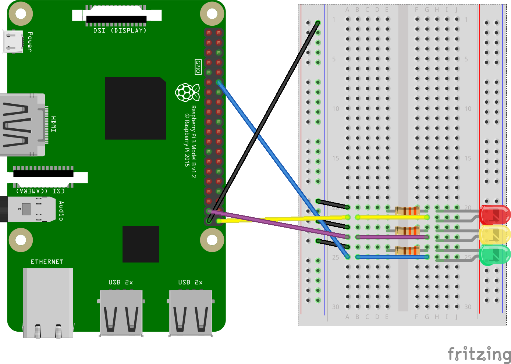

# js-led-example

This is a sample repository that illustrates how you might be able to use JavaScript or Python to interact with the general purpose input/output (GPIO) pins on a Raspberry Pi.  This will work with a Raspberry Pi 2, 3, or Zero.  I had to update the version of Node on the board to get this to work properly ([v10.15LTS](https://nodejs.org/dist/v10.15.3/node-v10.15.3.tar.gz))

For logging, I am using `winston`, following [this example](https://blog.risingstack.com/node-js-logging-tutorial/).

Wiring diagrams courtesy of https://fritzing.org.